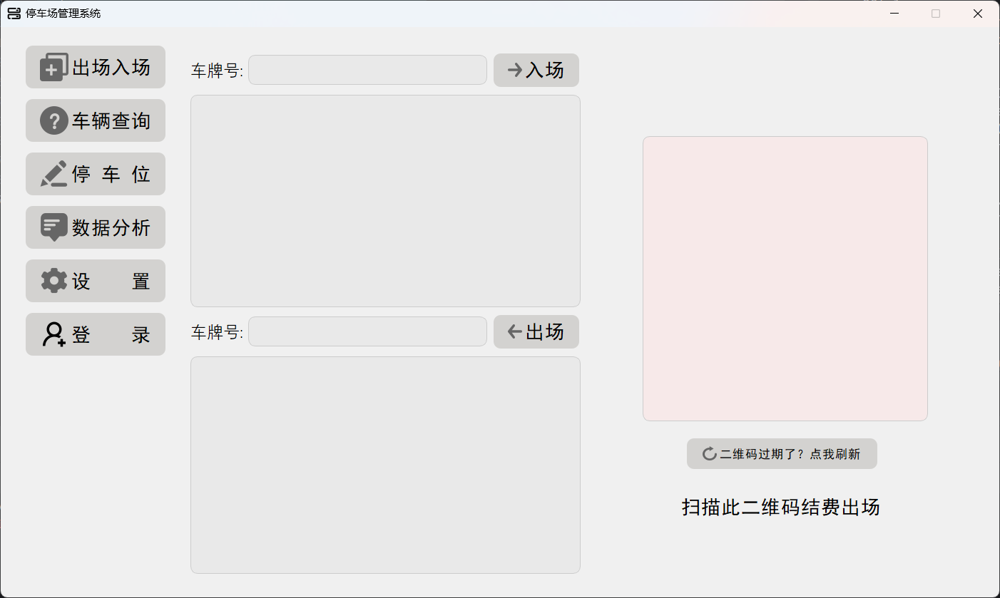
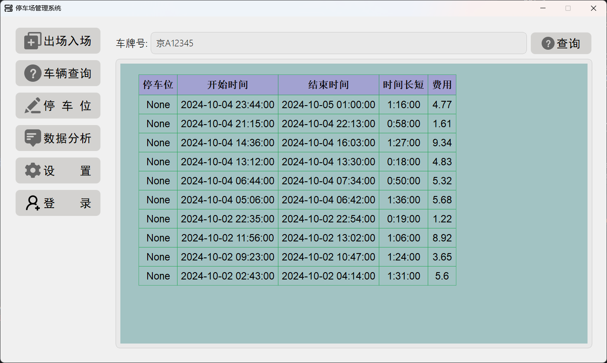
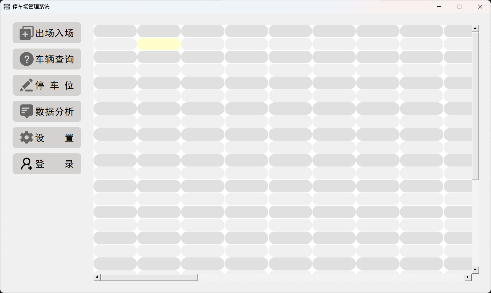
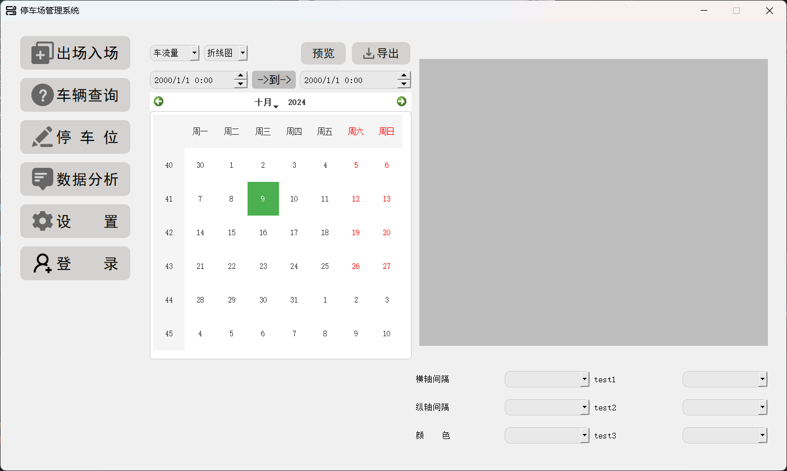
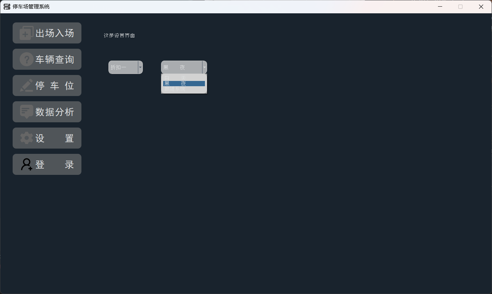
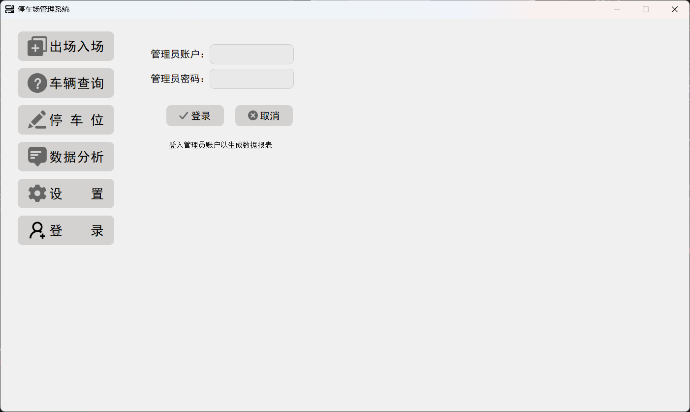

# 停车场管理系统作业
```python
# 代码结构
|-pic  # 图片资源文件
   |-background
   |-headshot
   |-login_png
   |-navi_png
   |-op_png       
|-main.py  # 主程序入口
|-button_rc.py  # 编译后资源文件
|-database_service.py  # 数据库服务层
|-date_anly.py  # 数据分析
|-parking_lot.py  # 重写 QStyledItemDelegate 的 paint 方法，用来展示停车位
|-test.py  # 模拟停车数据
|-ui.py  # 界面服务层
|-ui.ui  # 原始界面
```
# ui界面展示
## 1.出场入场界面

## 2.查询界面

## 3.停车位界面

## 4.数据分析界面

## 5.设置界面

## 6.管理员登录界面

